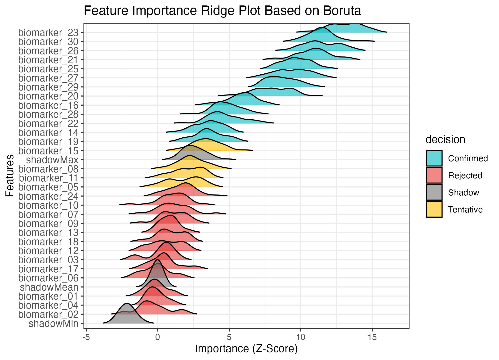

# boruta_ridge_plot

基于 R 语言，**模拟临床数据**并使用 `Boruta` 算法 进行**特征选择**，结果以**山脊图 (ridge plot)**进行可视化。

* 生成模拟临床数据集：包含 30 个生物标志物，并根据结局变量赋予轻微效应偏差。
* `Boruta` 特征选择：基于 `ranger` 随机森林，识别重要特征，并标注为 `Confirmed`、`Tentative` 或 `Rejected`。
* 特征重要性可视化：使用 `ggridges` 绘制山脊图，展示不同特征在多次迭代中的重要性分布，按**中位数（圆点）**排序。

